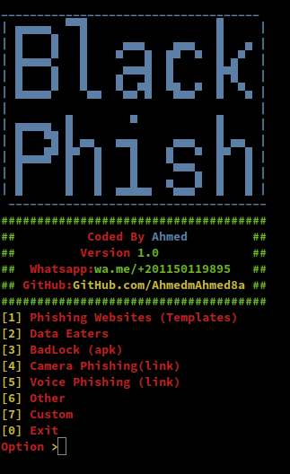

# BlackPhish

> ⚠️ **Disclaimer**  
> This tool is intended **solely for educational and authorized penetration testing purposes**.  
> Do **not** use this software on systems you do not own or lack explicit permission to test.  
> The author assumes **no responsibility** for misuse, loss, damage, or legal consequences.



---

## 🎯 What is BlackPhish?

**BlackPhish** is an educational phishing and malware simulation toolkit created for ethical hackers, red teams, and cybersecurity instructors.  
It provides a controlled environment to demonstrate the techniques used in social engineering attacks and mobile malware payloads.

---

## 📦 Key Features

### 🔹 [1] Phishing Websites (Templates)
Simulate login pages of popular platforms to test awareness and response to phishing attempts.

### 🔹 [2] Data Eaters (⚠️ Destructive APK)
> ⚠️ **WARNING: This generates a destructive Android APK that deletes all files and data on the target device.**  
> For **educational use only** in **virtual environments or emulators**. Never install on a real device.  
Use this to demonstrate the destructive potential of social engineering payloads.

### 🔹 [3] BadLock (⚠️ Lock APK)
> ⚠️ **WARNING: This builds an Android APK that locks the screen of the device.**  
> Use only in **controlled test environments**. This APK simulates ransomware-like behavior.  
Ideal for red team simulations or awareness training.

### 🔹 [4] Camera Phishing (Link)
Simulates phishing links that request access to the target’s camera via web browser.

### 🔹 [5] Voice Phishing (Link)
Simulates phishing links that attempt to access the microphone and record audio.

### 🔹 [6] Other
Additional simulation tools and tricks for training and experimentation.

### 🔹 [7] Custom
Build your own phishing templates or social engineering payloads with the custom builder.

---

## 📥 Installation

### ✅ For Android (via Termux), Ubuntu, or Kali Linux:

```bash
git clone https://github.com/MrEgyptian/BlackPhish
cd BlackPhish
bash installer.sh
```

Required tools:
- `php`
- `python`
- `ngrok`

---

## 💻 Usage

```bash
bash BlackPhish.sh
```

Select an option from the interactive menu to launch a simulation.

---

## 🛡️ Legal Warning

BlackPhish is meant for:
- ✅ **Ethical hacking labs**
- ✅ **Security awareness training**
- ✅ **Red team operations**
- ✅ **CTF exercises**

❌ **Do not use it for unauthorized or illegal purposes.**  
**You are fully responsible** for how you use this tool.

---

## 📜 License

This project is licensed under the **MIT License**. See the [LICENSE](LICENSE) file for details.

> The software is provided “as is”, without warranty of any kind. Use at your own risk.

---

## 📫 Author

**MrEgyptian**  
Telegram: [@MrAhmed](https://t.me/MrAhmed)  
GitHub: [MrEgyptian](https://github.com/MrEgyptian)
